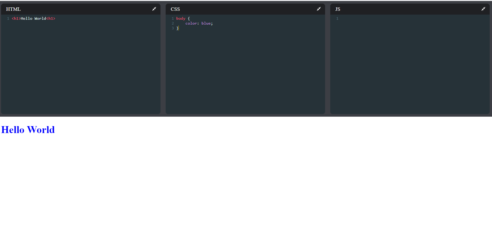

# CodeOnline

Code a website anywhere! Supports HTML , CSS & JS to make a fully responsive website!  
</img>

### Go To [this link](http://codeonline.igrohan.repl.co/) to test it out!

# Try It On Your Machine/Customize it
- Open your command prompt / powershell
- Clone this repository using `git clone https://github.com/IGRohan/CodeOnline.git`
- Now go into the cloned folder by using `cd CodeOnline`
- Install all the required dependencies using `npm install`
- Run the development server using `npm run start`
